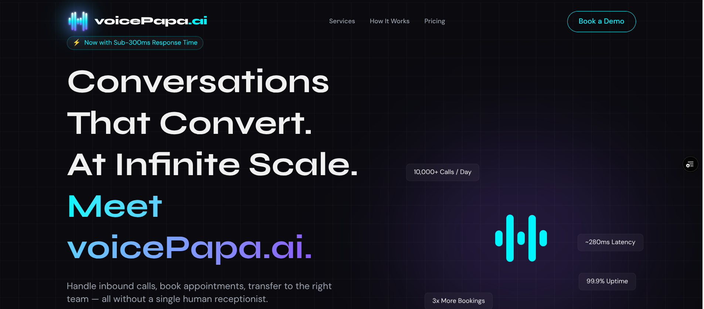

# voicePapa.ai — Conversations That Convert. At Infinite Scale.



> **Handle inbound calls, book appointments, transfer to the right team — all without a single human receptionist.**

[](https://voicepapa.ai)
[]()
[]()
[]()

---

## What is voicePapa.ai?

**voicePapa.ai** is an AI-powered voice agent platform that replaces traditional receptionists with intelligent, always-on voice agents. Our agents handle calls, book appointments, route inquiries, and run outbound campaigns — 24/7, at infinite scale, with sub-300ms latency.

- **HIPAA Compliant** | **SOC2 Certified** | **20+ Languages Supported**
- 3x more bookings compared to traditional front desk setups
- Zero hold time. Perfect brand tone. Every call.

---

## Watch the AI Receptionist in Action

> **Demo available on our website.**
> Visit [voicePapa.ai](https://voicepapa.ai) and watch the **AI Receptionist video demo** to see a live call handled end-to-end — from greeting to appointment booking — without any human involvement.

---

## Services

| Service | Description |
|---|---|
| **Inbound Call Handling** | Never miss a call. Our AI answers instantly, 24/7, with zero hold time and perfect brand tone. |
| **Outbound Campaigns** | Automated follow-ups, reminders, and lead outreach at scale with human-like conversational flow. |
| **AI Receptionist** | A fully trained virtual receptionist that knows your business inside out, handling FAQs and routing. |
| **Smart Appointment Booking** | Syncs with your calendar in real time. Books, reschedules, and confirms without human intervention. |
| **Intelligent Call Transfer** | Routes calls to the right human or department — only when a human touch is strictly necessary. |
| **Deep Integrations** | Connects to your CRM, calendar, and workflow tools natively for a seamless automated ecosystem. |

---

## Pricing

> Annual billing saves **20%** on all plans.

### Starter — $97/mo *(or $77/mo annual)*
**+ $299 one-time setup fee**

Perfect for small businesses.

- Up to **500 calls/month**
- **1 AI voice agent**
- Inbound + basic outbound
- Google Calendar integration
- Email support
- **7-day free trial**

---

### Growth — $297/mo *(or $237/mo annual)* — Most Popular
**+ $399 one-time setup fee**

For growing teams needing full automation.

- Up to **3,000 calls/month**
- **3 AI voice agents**
- Inbound + outbound + booking
- CRM integrations (HubSpot, GoHighLevel)
- Call transfer + routing
- Priority support + onboarding call
- Custom voice & personality

---

### Enterprise — Custom Pricing
**+ $699 one-time setup fee**

For high-volume or multi-location businesses.

- **Unlimited calls**
- **Unlimited agents**
- Custom integrations
- HIPAA / SOC2 compliance documentation
- Dedicated account manager
- SLA guarantee
- White-label option available

---

## Tech Stack

| Layer | Technology |
|---|---|
| Frontend | React 19, TypeScript, Tailwind CSS v4 |
| Bundler | Vite 6 |
| Backend | Express.js, Node.js |
| Animation | Motion (Framer Motion) |
| AI | Google Generative AI |
| Email | Nodemailer |
| Icons | Lucide React |

---

## Getting Started

### Prerequisites
- Node.js 18+
- npm or pnpm

### Installation

```bash
git clone https://github.com/hamzasaleem22/voicePapa.ai.git
cd voicePapa.ai
npm install
```

### Environment Setup

```bash
cp .env.example .env
# Fill in your API keys in .env
```

### Run Locally

```bash
npm run dev
```

Visit `http://localhost:3000`

### Build for Production

```bash
npm run build
npm run preview
```

---

## Contact & Demo

- **Book a Demo:** [voicePapa.ai](https://voicepapa.ai)
- **Email:** saramsaleem16@gmail.com

---

*voicePapa.ai — AI voice agents that never sleep, never miss a call, and always close.*
